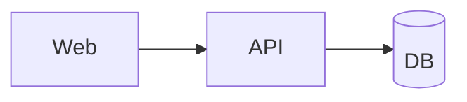

# arch — 架构图交互模式

参考：
- https://github.com/tt-a1i/archify
- https://github.com/Cocoon-AI/architecture-diagram-generator

本机渲染器：`~/.claude/skills/archify`（`node bin/archify.mjs`，已同步 **v2.15.0**）  
Talk 桥：`~/.pi/agent/extensions/lib/talk/arch-render.mjs`

## 用法

```text
/talk arch
talk_set_style({ styleId: "arch" })
talk_render({ styleId: "arch", title: "系统架构", content: "<Archify JSON or HTML or Mermaid>" })
```

## content 三种输入

### 1) Archify JSON IR（推荐）

```json
{
  "schema_version": 1,
  "diagram_type": "architecture",
  "meta": { "title": "Sample", "subtitle": "…" },
  "components": [
    { "id": "api", "type": "backend", "label": "API", "sublabel": "FastAPI", "pos": [200, 120], "size": [130, 60] }
  ],
  "connections": [
    { "from": "web", "to": "api", "label": "HTTPS" }
  ],
  "cards": [
    { "dot": "emerald", "title": "Notes", "items": ["…"] }
  ]
}
```

`diagram_type`：`architecture` | `workflow` | `sequence` | `dataflow` | `lifecycle`

完整字段见：
- `~/.claude/skills/archify/schemas/*.schema.json`
- `~/.claude/skills/archify/examples/*.json`

### 2) 完整 HTML

Cocoon 风格手写 SVG HTML，或已渲染的 archify 产物，直接透传并注入 talk 反馈条。

### 3) Mermaid



无 Archify 布局时的轻量回退（CDN mermaid）。

## Agent 工作流

1. 读仓库 / 用户描述 → 选 diagram_type  
2. 写 JSON（8–12 组件，一条主路径，细节进 cards）  
3. `talk_render` style=arch  
4. 用户点「好看/简化/补关系」→ `talk_poll_events` → 改 JSON 再渲染  

## 布局原则（来自 Archify）

- 一条主路径，左→右  
- 少标边；次要分支上下连，不斜穿  
- 细节放 cards，不堆箭头  
- 校验失败按 Suggested fix 改坐标，勿盲改 renderer  

## v2.15 可用的新能力（可选）

- `meta.legend`：`auto` / `all` / `hidden` + 自定义图例文案（v2.13）
- `meta.engineering_profile: "deployment-ownership"`：部署归属评审（显式开启，v2.13）
- 组件 `brand` 字段：官方品牌徽标（`archify brands` 查目录，v2.15）
- sequence `meta.column_fit: "spread"`：宽版时序布局（v2.15）
- `archify validate <type> <input> --json`：结构化 diagnostics（稳定规则码+修复建议），渲染失败时优先用它定位
- `archify compare architecture <base> <head>`：架构演进 Before/Delta/After 证明（v2.13）
- `archify visual-check <output.html> --json`：多视口首屏测量+明暗截图证据（v2.14）

交互层已适配 v2.13+ 的 `<g data-node-id>` 语义钩子：拖拽整组移动（不再撕裂 sigil/brand），
旧版渲染产物自动回退到 rect 启发式。
